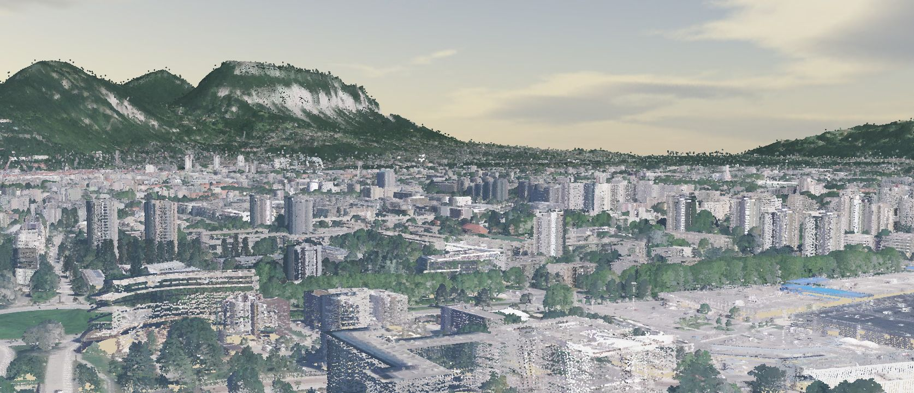

.. image:: https://img.shields.io/gitlab/pipeline/Oslandia/py3dtiles/master
    :target: https://gitlab.com/Oslandia/py3dtiles/-/pipelines
    :alt: Build pipeline status

.. image:: https://img.shields.io/pypi/v/py3dtiles
    :target: https://pypi.org/project/py3dtiles/
    :alt: Py3dtiles version on pypi

.. image:: https://img.shields.io/pypi/pyversions/py3dtiles.svg
    :target: https://pypi.org/project/py3dtiles/
    :alt: Supported python versions

.. image:: https://img.shields.io/gitlab/last-commit/Oslandia/py3dtiles?gitlab_url=https%3A%2F%2Fgitlab.com
    :alt: GitLab last commit

.. image:: https://img.shields.io/badge/code%20style-black-000000.svg
    :target: https://github.com/psf/black
    :alt: black code format

.. image:: https://img.shields.io/gitlab/license/Oslandia/py3dtiles
    :alt: Py3dtiles license

Py3dtiles
#########

Py3dtiles is a CLI tool and a library writing with Python for creating and manipulating `3D Tiles <http://www.opengis.net/doc/cs/3D-Tiles/1.1>`_.

Features
========

Tileset manipulation
--------------------

* Read lazily tileset (to avoid useless memory consumption)
* Write tileset with the tile contents
* Browse the tile structure, access to the properties and tile content with the ability to modify them
* Read and write pnts and b3dm with the batch table support

Tiling tools
------------

All tiling tools are **available with the API and the CLI**

* Convert data into 3d tiles (tileset.json + pnts/b3dm files). The supported file formats are:
    * las/laz
    * xyz
    * ply
    * wkb
* Merge 3D Tiles tilesets into one tileset
* Read pnts and b3dm files and print a summary of their contents

Installation
===============

To install Py3dtiles with pip (recommended method)

.. code-block:: bash

    $ pip install py3dtiles

For more information about installation (laz support or install from source), you could read the installation section in the `documentation <https://oslandia.gitlab.io/py3dtiles/>`_

API basic example
=================

.. code-block:: python

    >>> from pathlib import Path
    >>>
    >>> from py3dtiles.tileset.tileset import TileSet
    >>>
    >>> tileset = TileSet.from_file(Path("mytileset.json"))
    >>> all_tiles = (tileset.root_tile, *tileset.root_tile.get_all_children())
    >>> for tile in all_tiles:
    ...     if not tile.has_content():
    ...         continue
    ...     tile_content = tile.get_or_fetch_content()
    ...     print(f"The tile {tile.content_uri} has a content of {type(tile_content)} type")
    ...     print(f"with this bounding volume: {tile.bounding_volume.to_dict()}")
    >>>

Result example
==============

The data visualized on this website is generated with the ``convert`` and ``merge`` CLI command of Py3dtiles: https://giro3d.org/examples/lidar_hd.html

The library used on this site is `giro3d <https://giro3d.org/index.html>`_ but to visualize 3d tiles, `cesium <https://cesium.com/>`_ can be also used.

Documentation
=============

The CLI and API documentation with examples are available here:

- master: https://oslandia.gitlab.io/py3dtiles/master
- last stable: https://oslandia.gitlab.io/py3dtiles/

Roadmap
=======

The objectives are:

- to support the standard at version 1.1 (mainly gltf as content)
- to convert more file formats
- to have a better tiler for geometries

Contributing
============

We welcome new contributors. This may fix an issue or add a feature, but also:

- report an issue
- review a MR
- improve the documentation or create a tutorial
- talk about this project to others

License
=======

Py3dtiles is distributed under the Apache 2 Licence.
